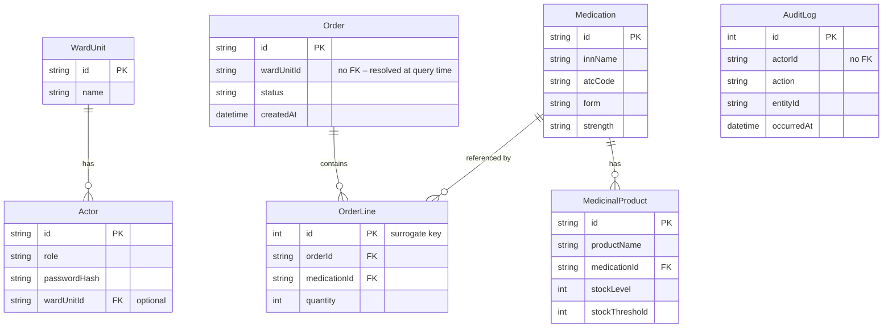
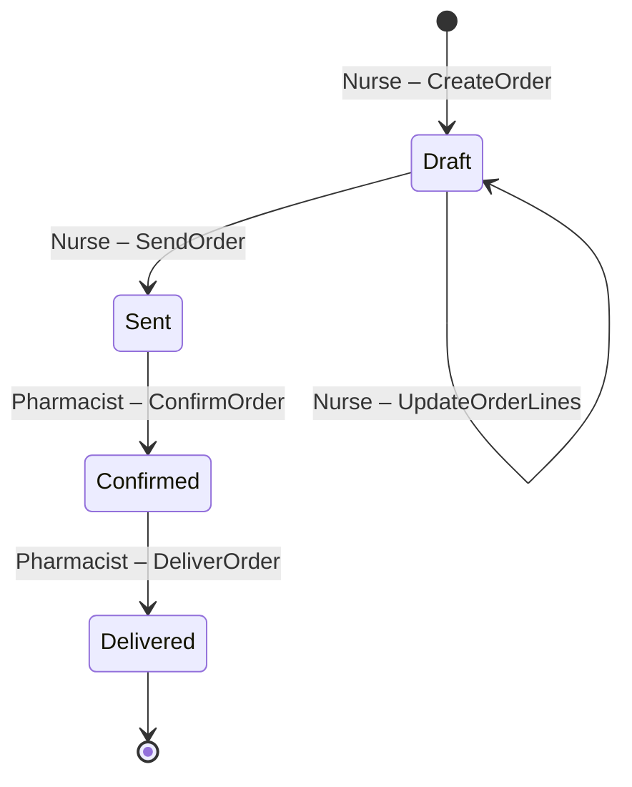
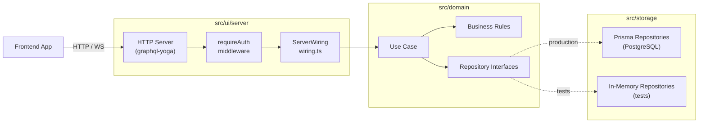
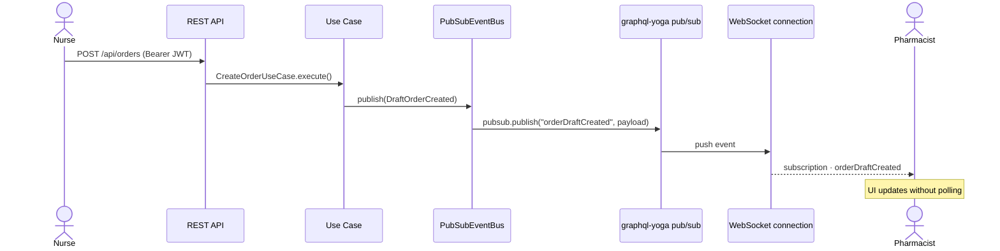

# Architecture Diagrams

## System Overview

The three frontend apps communicate with the single backend over REST (mutations), GraphQL HTTP (queries), and GraphQL WebSocket (real-time subscriptions). All apps share code via the `packages/` workspace.

```mermaid
graph TD
  subgraph "Frontend apps"
    N["Nurse App\napps/nurse"]
    P["Pharmacist App\napps/pharmacist"]
    A["Admin App\napps/admin"]
  end

  subgraph "Shared packages"
    UI["packages/ui\nReact components"]
    CL["packages/client\nAuthContext · HTTP/GQL client"]
    CF["packages/config\nBase URLs"]
  end

  subgraph "Backend · localhost:4000"
    REST["REST API\nPOST /api/..."]
    GQL["GraphQL HTTP\n/graphql"]
    WS["GraphQL WebSocket\nws://localhost:4000/graphql"]
    DOMAIN["Domain layer\nUse cases · Business rules"]
    REPOS["Repository layer\nPrisma implementations"]
    EB["PubSubEventBus"]
  end

  DB[("PostgreSQL")]

  N & P & A --> UI & CL & CF
  CL -->|"mutations (JWT)"| REST
  CL -->|"queries (JWT)"| GQL
  CL -->|"subscriptions (JWT in connectionParams)"| WS
  REST --> DOMAIN
  GQL --> DOMAIN
  DOMAIN --> REPOS
  DOMAIN --> EB
  EB --> WS
  REPOS --> DB
```

---

## Data Model

Relationships between the persisted entities (as defined in `prisma/schema.prisma`).

---

## Order Lifecycle

An order moves through four statuses. Only a Nurse can create and send orders; only a Pharmacist can confirm and deliver them.

---

## Request Flow (Layered Architecture)

Every request passes through auth middleware, then reaches a use case via the `ServerWiring` object assembled in `src/ui/server/wiring.ts`. Use cases depend only on repository *interfaces*, so the storage layer is swappable (Prisma for production, in-memory for tests).

---

## Real-Time Event Flow

When a use case mutates state it publishes a domain event through the `EventBus`. In the running server this is `PubSubEventBus`, which bridges the event into graphql-yoga's pub/sub system so subscribed frontend clients are notified immediately.

**Current domain events**

| Event | Subscription |
|---|---|
| `DraftOrderCreated` | `orderDraftCreated` |
| `DraftOrderUpdated` | `orderDraftUpdated` |
| `OrderStatusAdvanced` | `orderStatusChanged` |
| `StockBelowThreshold` | `stockBelowThreshold` |
